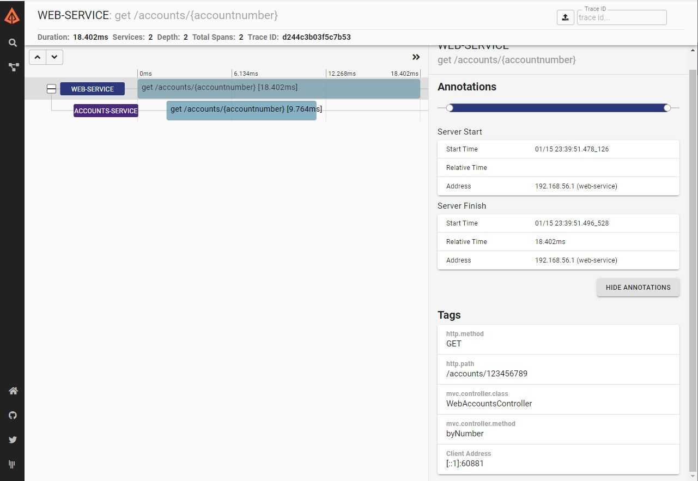
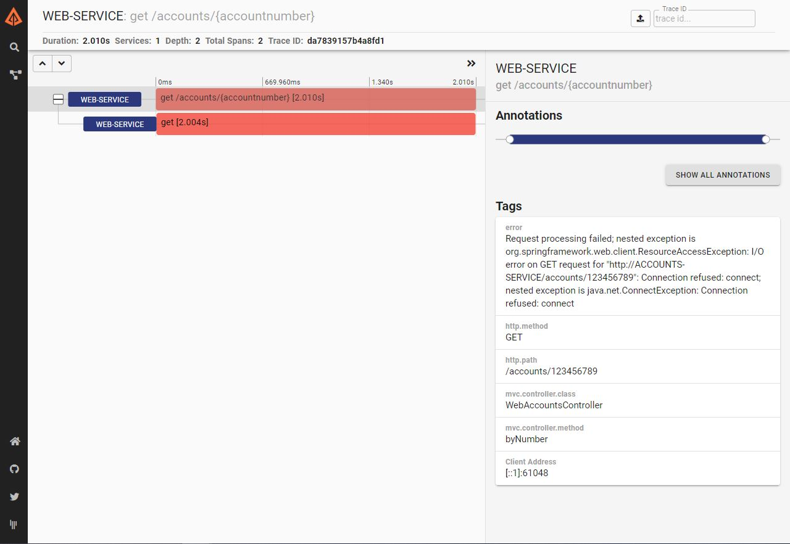

# Bonus: Spring Cloud Sleuth and Zipkin integration

In order to get a trace of every request, Cloud Sleuth allows microservices to share a unique request ID via HTTP headers.

In order to save the traces of execution a Zipkin server is needed. First attemp was using a `@EnableZipkinServer` annotation. 
However, this method appears to be deprecated. Instead, you can download a JAR version 
([zipkin-server-2.19.2-exec.jar](https://repo1.maven.org/maven2/io/zipkin/zipkin-server/2.19.2/zipkin-server-2.19.2-exec.jar)) 
and execute the Zipkin server with:

```bash
java -jar zipkin-server-2.19.2-exec.jar
```

This functionality has been tested in a correct use case, showing the propagation of the request from WEB-SERVICE 
microservice to ACCOUNT-SERVICE:




On the other hand, when the ACCOUNT-SERVICE is DOWN, the trace show the error like:


