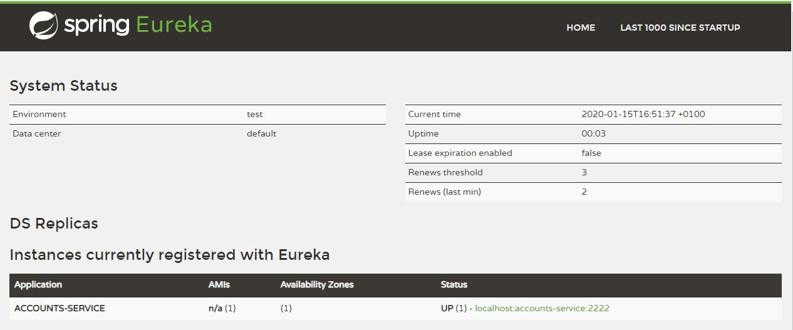

# How to start microservices

Written by Vícto M. Batllte <<736478@unizar.es>>

## Service Registration (`registration`)

So as to launch the Eureka server, execute the following commands:

```bash
gradle registration:bootRun
```
o
```bash
cd /path/to/git/repository
cd registration
gradle bootRun
```

As a result, you will obtain the following logs:


If now you access `http://localhost:1111/` ([link](http://localhost:1111/)), you should be able to see:


## Microservice account service (`accounts`)

Now, we will launch ther first microservice and register it into Eureka.

```bash
gradle accounts:bootRun
```
o
```bash
cd ../accounts
gradle bootRun
```

As a result, you will obtain the following logs:


Accessing to `http://localhost:1111/` ([link](http://localhost:1111/)), you should be able to see the new service:



And a request to `http://localhost:2222/actuator/info` ([link](http://localhost:2222/actuator/info)) will return the following data:

```json
{ 
    "app":{ 
        "name":"Microservices Demo - Accounts Server",
        "description":"This is a RESTful web service",
        "version":"1.0.0"
    }
}
```

## Microservice web service (`web`)

Finally, it's time to launch the MVC front-end application, by running:

```bash
gradle web:bootRun
```
o
```bash
cd ../web
gradle bootRun
```

The log output for that command should end with:


The dashboard at `http://localhost:1111/` ([link](http://localhost:1111/)) should show now both services:


And a request to `http://localhost:3333/` ([link](http://localhost:3333/)) will show a list of demo options. In the next screenshot it's displayed the results of clicking 3rd and 4th options:


## Second account service (`accounts`)

When needed, a second account service may be lauched as in the previous chapter, resulting into a second "availability zone":


## Kill the microservice with port 2222 (`accounts`)

If now we kill the microservice running at port `2222`, [the aplication](http://localhost:3333/accounts/123456789) continues working.

When the web service asks the register server for the URI of the account service, it will be replay with the `:4444` (wich remains UP) instead of the `:2222` (which is DOWN).
